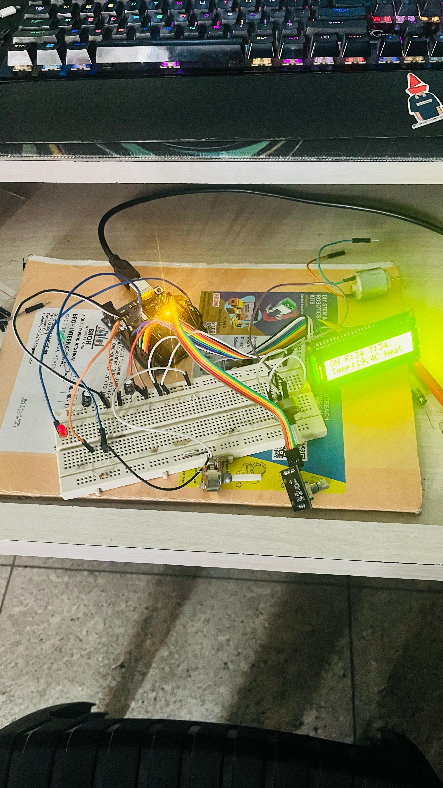
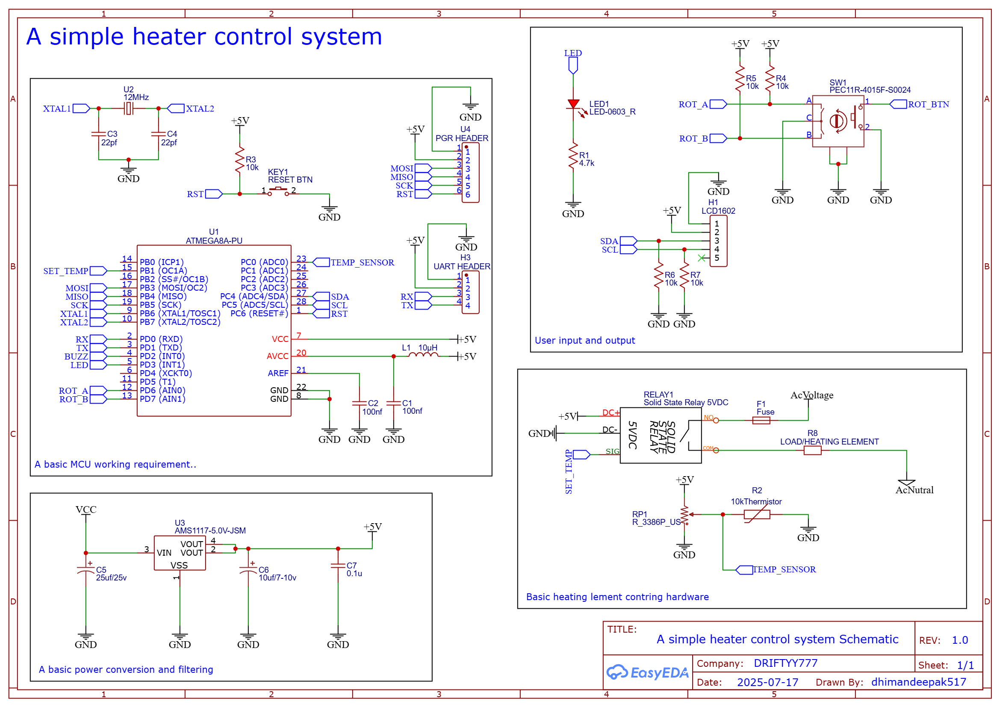

# Simple Heater Control System

A precise Arduino-based temperature control system with rotary encoder interface and LCD display for managing heated bed applications.

## 🌟 Features

- **Precise Temperature Control**: Maintains target temperature within ±2°C tolerance
- **Rotary Encoder Interface**: Smooth temperature adjustment with button controls
- **Dual LCD Support**: Compatible with both I2C and 4-bit parallel LCD displays
- **Safety Features**: 
  - Overheat protection (max 160°C)
  - Temperature range limiting (30-150°C)
  - System state monitoring
- **PWM Heating Control**: Efficient heater control with adjustable duty cycle
- **NTC Thermistor Support**: 10kΩ NTC thermistor with beta coefficient compensation
- **Display Sleep Mode**: Power-saving display timeout after 30 seconds of inactivity
- **Serial Debug Output**: Real-time monitoring via serial interface

## 📋 Table of Contents

- [Hardware Requirements](#hardware-requirements)
- [Pin Configuration](#pin-configuration)
- [Software Dependencies](#software-dependencies)
- [Installation](#installation)
- [Configuration](#configuration)
- [Usage](#usage)
- [Safety Features](#safety-features)
- [Troubleshooting](#troubleshooting)
- [Project Gallery](#project-gallery)

## 🔧 Hardware Requirements

### Core Components
- **Arduino Uno** (or compatible ATmega328P board)
- **16x2 LCD Display** (I2C or 4-bit parallel)
- **Rotary Encoder** with push button
- **10kΩ NTC Thermistor** (Beta = 3590K)
- **10kΩ Pull-up Resistor** for thermistor
- **Heating Element** (12V/24V compatible)
- **MOSFET** or **Relay Module** for heater control
- **LED Indicator**
- **Power Supply** (12V/5V depending on setup)

### Optional Components
- **Heat Sink** for temperature sensor
- **Enclosure** for safety
- **Cooling Fan** for temperature regulation

## 📌 Pin Configuration

| Component | Arduino Pin | Function |
|-----------|-------------|----------|
| Temperature Sensor | A0 | Analog input for NTC thermistor |
| Heater Control | 9 | PWM output for heating element |
| Status LED | 3 | System status indicator |
| Rotary Encoder A | 6 | Encoder channel A |
| Rotary Encoder B | 7 | Encoder channel B |
| Rotary Button | 5 | Encoder push button |
| LCD Backlight | 2 | Backlight control (4-bit LCD) |
| LCD (4-bit mode) | A1-A5, 4 | Data and control pins |
| LCD (I2C mode) | A4, A5 | SDA, SCL |

## 📚 Software Dependencies

### PlatformIO Libraries
- **LiquidCrystal** (v1.0.7) - For 4-bit LCD support
- **LiquidCrystal_I2C** (v1.1.3) - For I2C LCD support
- **Encoder** (v1.4.4) - Enhanced rotary encoder handling (Not used)

### Development Environment
- **PlatformIO IDE** (recommended)
- **Arduino IDE** (alternative)
- **Platform**: Atmel AVR
- **Framework**: Arduino

## 🚀 Installation

### 1. Clone the Repository
```bash
git clone https://github.com/yourusername/simple_heater_control_sys.git
cd simple_heater_control_sys
```

### 2. Hardware Assembly
1. Connect components according to the pin configuration table
2. Ensure proper power supply connections
3. Install thermistor with appropriate heat transfer medium
4. Verify all connections before powering on

### 3. Software Setup
```bash
# Using PlatformIO
pio run --target upload

# Or using Arduino IDE
# Open src/main.cpp in Arduino IDE
# Install required libraries
# Select Arduino Uno board
# Upload to device
```

## ⚙️ Configuration

### LCD Display Type
Choose between I2C and 4-bit parallel LCD by modifying the define in `main.cpp`:

```cpp
// For I2C LCD (comment the line below)
// #define NON_I2C_LCD

// For 4-bit parallel LCD (uncomment the line below)
#define NON_I2C_LCD
```

### Temperature Settings
Adjust temperature limits in the configuration section:

```cpp
int minTempC = 30;   // Minimum temperature (°C)
int maxTempC = 150;  // Maximum temperature (°C)
float maxBoardTemp = 160.0;  // Safety limit (°C)
float tempTolerance = 2.0;   // Control tolerance (°C)
```

### Thermistor Calibration
Modify thermistor parameters for your specific sensor:

```cpp
constexpr float seriesResistor = 10000.0;    // Series resistor value
constexpr float nominalResistance = 10000.0; // Resistance at 25°C
constexpr float nominalTemperature = 25.0;   // Reference temperature
constexpr float betaCoefficient = 3590.0;    // Beta coefficient
```

## 🎮 Usage

### Basic Operation
1. **Power On**: System starts with display showing current temperature
2. **Set Temperature**: Rotate encoder to adjust target temperature (30-150°C)
3. **Confirm Setting**: Press encoder button to confirm selection
4. **Monitor**: Display shows current vs target temperature and heating status
5. **Safety**: System automatically shuts down if overheating is detected

### Control Interface
- **Rotate Clockwise**: Increase target temperature
- **Rotate Counter-clockwise**: Decrease target temperature  
- **Short Press**: Confirm setting / Wake display
- **Long Press** (1 second): System on/off toggle
- **Below 27°C**: System automatically turns off

### Display Information
```
Line 1: Current: XXX°C
Line 2: Target: XXX°C [ON/OFF]
```

## 🛡️ Safety Features

### Temperature Monitoring
- Continuous temperature sensing with 500ms update interval
- Automatic shutdown at 160°C maximum temperature
- Temperature tolerance control (±2°C) for stable operation

### System Protection
- Input validation for temperature ranges
- PWM duty cycle limiting
- Display sleep mode for power conservation
- Overheat detection and protection

### Error Handling
- Sensor disconnection detection
- Invalid temperature reading protection
- System state monitoring

## 🔧 Troubleshooting

### Common Issues

**Display not working:**
- Check LCD type configuration (#define NON_I2C_LCD)
- Verify power connections (5V/3.3V)
- Confirm I2C address (default: 0x27)

**Temperature reading incorrect:**
- Verify thermistor connections
- Check series resistor value (10kΩ)
- Calibrate beta coefficient for your thermistor

**Rotary encoder not responding:**
- Ensure pull-up resistors are enabled
- Check debounce settings
- Verify pin connections

**Heating not working:**
- Test MOSFET/relay operation
- Check PWM output on pin 9
- Verify heater element continuity

### Serial Debug
Connect to serial monitor at 9600 baud for debugging information:
- Temperature readings
- Rotary encoder values
- System state changes
- PWM duty cycle

## 🤝 Contributing

1. Fork the repository
2. Create a feature branch (`git checkout -b feature/amazing-feature`)
3. Commit your changes (`git commit -m 'Add amazing feature'`)
4. Push to the branch (`git push origin feature/amazing-feature`)
5. Open a Pull Request

## 📄 License

This project is licensed under the MIT License - see the [LICENSE](LICENSE) file for details.

## 👨‍💻 Author

**DRIFTYY777**
- Date: July 17, 2025
- Project: Basic Heater Control System

---

## 📸 Project Gallery

### Hardware Assembly

*Complete hardware assembly showing Arduino Uno, LCD display, and rotary encoder*


*Close-up view of the control interface and connections*


*Temperature sensor mounting and heater element setup*

### System Operation

*LCD display showing current temperature readings and target settings*


*System in operation with heating element active*


*Complete assembled system ready for deployment*

### Circuit Schematic

*Detailed circuit diagram showing all connections and component values*

### Video Demonstration

*Video demonstration of the system in operation*

### Technical Documentation
- [Complete Circuit Schematic (PDF)](schematics/Schematic_simple_heater_control_system.pdf)
- [Hardware Assembly Guide](docs/assembly-guide.md)
- [Software Configuration Manual](docs/configuration.md)

---

⭐ **Star this repository if you found it helpful!**

📧 **Questions?** Open an issue or contact the author.

🔧 **Want to contribute?** Check out our [Contributing Guidelines](CONTRIBUTING.md).
